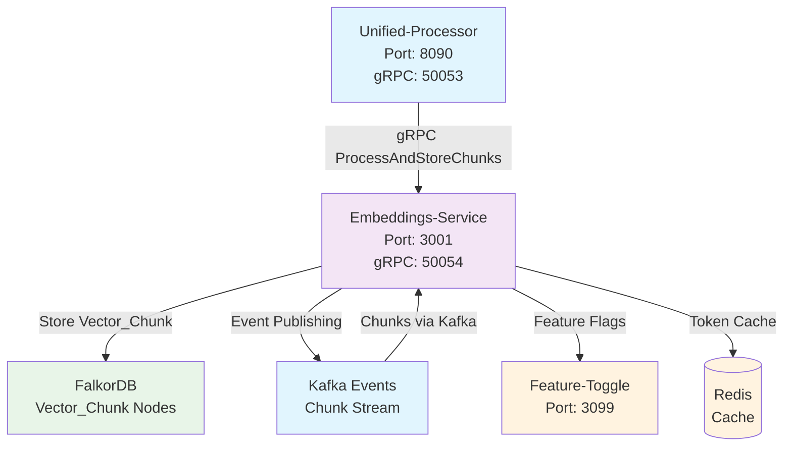
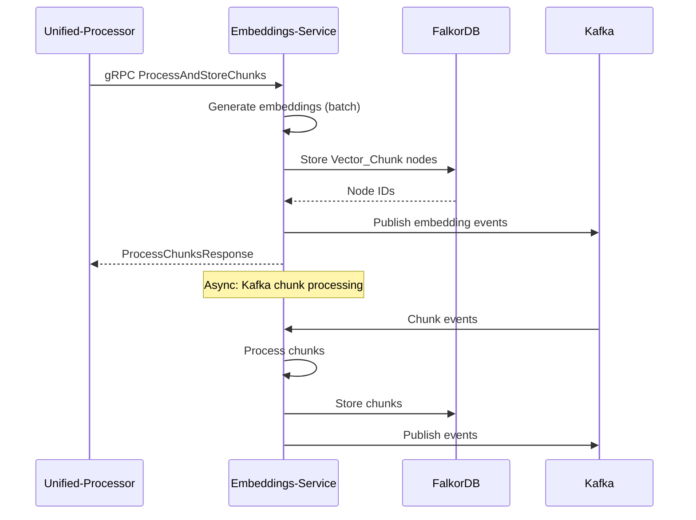
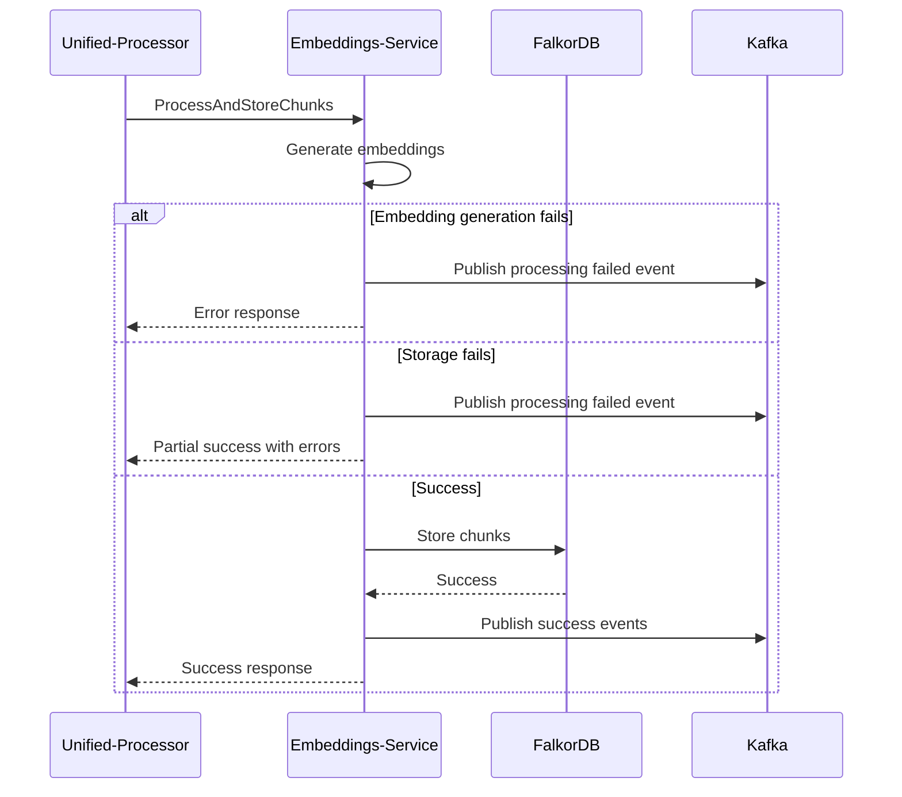

# ConFuse Embeddings Service

> **Vector Embedding Generation and Storage Service**

## What is this service?

The **embeddings-service** is ConFuse's dedicated vector embedding generation service that creates high-quality embeddings for text content and stores them directly in FalkorDB as `Vector_Chunk` nodes. It operates as a **generate-only** service with **gRPC-based communication**.

## Quick Start

```bash
# Clone and install
git clone https://github.com/confuse/embeddings-service.git
cd embeddings-service

# Install Rust dependencies
cargo build --release

# Configure environment
cp .env.map.example .env.map
cp .env.secret.example .env.secret

# Start the service
cargo run --release
```

The service starts at:
- **HTTP**: `http://localhost:3001`
- **gRPC**: `localhost:50054`

## API Endpoints

### HTTP API (Port 3001)

#### Health and Status
```http
# Health check
GET /health

# Service status
GET /status

# Detailed status with dependencies
GET /status/detailed

# Model health
GET /api/v1/models/health

# FalkorDB connection status
GET /api/v1/falkordb/health
```

#### Embedding Generation
```http
# Generate single embedding
POST /api/v1/generate
{
  "text": "Sample text for embedding",
  "model": "all-MiniLM-L6-v2"
}

# Generate batch embeddings
POST /api/v1/generate/batch
{
  "texts": ["Text 1", "Text 2", "Text 3"],
  "model": "all-MiniLM-L6-v2"
}

# Process chunks (HTTP alternative to gRPC)
POST /api/v1/graphiti/chunks
{
  "chunks": [
    {
      "chunk_id": "chunk-123",
      "content": "Sample chunk content",
      "source_id": "source-456",
      "metadata": {
        "file_path": "/path/to/file",
        "language": "python"
      }
    }
  ],
  "model": "all-MiniLM-L6-v2"
}
```

#### Model Management
```http
# List available models
GET /api/v1/models

# Get model information
GET /api/v1/models/{model_name}

# Get model performance stats
GET /api/v1/models/{model_name}/stats

# Load model into memory
POST /api/v1/models/{model_name}/load

# Unload model from memory
POST /api/v1/models/{model_name}/unload
```

#### Monitoring and Metrics
```http
# Service metrics
GET /metrics

# Performance statistics
GET /api/v1/stats

# Embedding generation metrics
GET /api/v1/metrics/embeddings

# FalkorDB operation metrics
GET /api/v1/metrics/falkordb
```

### gRPC Service (Port 50054)

#### Service Definition
```protobuf
service Embeddings {
  // Main processing method
  rpc ProcessAndStoreChunks(ProcessChunksRequest) returns (ProcessChunksResponse);
  
  // Embedding generation without storage
  rpc BatchEmbed(BatchEmbedRequest) returns (BatchEmbedResponse);
  
  // Single embedding generation
  rpc Embed(EmbedRequest) returns (EmbedResponse);
  
  // Model management
  rpc GetModelInfo(ModelInfoRequest) returns (ModelInfoResponse);
  rpc LoadModel(LoadModelRequest) returns (LoadModelResponse);
  rpc UnloadModel(UnloadModelRequest) returns (UnloadModelResponse);
  
  // Health checks
  rpc HealthCheck(HealthCheckRequest) returns (HealthCheckResponse);
  rpc ServiceStatus(ServiceStatusRequest) returns (ServiceStatusResponse);
}
```

#### Key Message Types
```protobuf
message ProcessChunksRequest {
  repeated ChunkData chunks = 1;
  optional string model = 2;
  map<string, string> options = 3;
}

message ChunkData {
  string chunk_id = 1;
  string content = 2;
  string source_id = 3;
  string file_path = 4;
  string chunk_type = 5;
  string level = 6;
  string tier = 7;
  float confidence = 8;
  int64 created_at = 9;
  ChunkMetadata metadata = 10;
}

message ChunkMetadata {
  repeated int32 line_range = 1;
  float complexity_score = 2;
  int32 token_count = 3;
  map<string, string> custom = 4;
}

message ProcessChunksResponse {
  repeated ChunkResult results = 1;
  string model_used = 2;
  int32 total_chunks = 3;
  int32 chunks_stored = 4;
  int32 chunks_failed = 5;
  repeated string errors = 6;
  ProcessingStats stats = 7;
}

message ChunkResult {
  string chunk_id = 1;
  string stored_node_id = 2;
  bool stored = 3;
  optional string error = 4;
  int64 processing_time_ms = 5;
}

message BatchEmbedRequest {
  repeated string texts = 1;
  string model = 2;
  map<string, string> options = 3;
}

message BatchEmbedResponse {
  repeated EmbeddingResult results = 1;
  string model_used = 2;
  int64 processing_time_ms = 3;
  repeated string errors = 4;
}

message EmbeddingResult {
  string text = 1;
  repeated float embedding = 2;
  int32 dimension = 3;
  optional string error = 4;
}
```

#### Error Handling
```protobuf
message EmbeddingsError {
  string code = 1;
  string message = 2;
  map<string, string> details = 3;
  google.protobuf.Timestamp timestamp = 4;
}

enum ErrorCode {
  ERROR_CODE_UNSPECIFIED = 0;
  ERROR_CODE_MODEL_NOT_FOUND = 1;
  ERROR_CODE_MODEL_LOADING_FAILED = 2;
  ERROR_CODE_INVALID_INPUT = 3;
  ERROR_CODE_FALKORDB_ERROR = 4;
  ERROR_CODE_KAFKA_ERROR = 5;
  ERROR_CODE_RATE_LIMITED = 6;
  ERROR_CODE_PROCESSING_FAILED = 7;
}
```

## Documentation

| Document | Description |
|----------|-------------|
| [Architecture](architecture.md) | Service design and gRPC flows |
| [Configuration](configuration.md) | Environment variables |
| [Models](models.md) | Embedding models and configuration |
| [FalkorDB Integration](falkordb.md) | Vector storage implementation |

## How It Fits in ConFuse



## Key Features

### 1. **Vector Generation Only**
- **Generate-Only Service**: Focuses solely on embedding generation
- **Direct Storage**: Stores embeddings directly in FalkorDB
- **Batch Processing**: Efficient batch embedding generation
- **Multiple Models**: Support for various embedding models

### 2. **gRPC-Based Communication**
- **Primary Interface**: gRPC service for unified-processor
- **ProcessAndStoreChunks**: Main gRPC method for processing
- **BatchEmbed**: Batch embedding generation endpoint
- **HTTP API**: Secondary HTTP interface for management

### 3. **FalkorDB Integration**
- **Direct Connection**: Native FalkorDB client integration
- **Vector_Chunk Nodes**: Stores embeddings as graph nodes
- **Vector Search**: Native vector similarity search capabilities
- **Metadata Storage**: Rich metadata alongside embeddings

### 4. **Kafka Event Pipeline**
- **Chunk Processing**: Receives chunks via Kafka from unified-processor
- **Event Publishing**: Publishes embedding generation events
- **Async Processing**: Asynchronous chunk processing pipeline
- **Error Handling**: Comprehensive error handling and retry logic

## Technology Stack

| Technology | Purpose | Version |
|------------|---------|---------|
| **Rust** | Runtime | Latest |
| **Axum** | Web Framework | >=0.7 |
| **gRPC** | Service Communication | >=0.10 |
| **FalkorDB** | Vector Storage | Latest |
| **Redis** | Caching | >=0.27 |
| **PyO3** | Python Integration | >=0.23 |
| **Ollama** | Local Models | Latest |
| **Kafka** | Event Streaming | Latest |

## Service Architecture

### Core Components

#### 1. **gRPC Server**
- **ProcessAndStoreChunks**: Main processing method
- **BatchEmbed**: Batch embedding generation
- **ModelInfo**: Model information and capabilities
- **Health Checks**: Service health monitoring

#### 2. **Embedding Generator**
- **Model Manager**: Multiple model support and loading
- **Batch Processing**: Efficient batch embedding generation
- **Model Switching**: Dynamic model selection
- **Performance Optimization**: Memory and compute optimization

#### 3. **FalkorDB Client**
- **Vector Storage**: Direct Vector_Chunk node creation
- **Vector Search**: Native similarity search capabilities
- **Connection Management**: Connection pooling and health
- **Transaction Support**: Atomic operations

#### 4. **Event Publisher**
- **Kafka Integration**: Event publishing and consumption
- **Event Types**: Embedding generated, processing failed
- **Async Processing**: Non-blocking event publishing
- **Error Handling**: Retry logic and error recovery

## gRPC Service Interface

### Main Service Definition
```protobuf
service Embeddings {
  // Process chunks and store as Vector_Chunk nodes
  rpc ProcessAndStoreChunks(ProcessChunksRequest) returns (ProcessChunksResponse);
  
  // Generate embeddings without storage
  rpc BatchEmbed(BatchEmbedRequest) returns (BatchEmbedResponse);
  
  // Generate single embedding
  rpc Embed(EmbedRequest) returns (EmbedResponse);
  
  // Get model information
  rpc GetModelInfo(ModelInfoRequest) returns (ModelInfoResponse);
  
  // Health check
  rpc HealthCheck(HealthCheckRequest) returns (HealthCheckResponse);
}
```

### Key Messages

#### ProcessAndStoreChunks Request
```protobuf
message ProcessChunksRequest {
  repeated ChunkData chunks = 1;
  optional string model = 2;
  map<string, string> options = 3;
}

message ChunkData {
  string chunk_id = 1;
  string content = 2;
  string source_id = 3;
  string file_path = 4;
  string chunk_type = 5;
  string level = 6;
  string tier = 7;
  float confidence = 8;
  int64 created_at = 9;
  ChunkMetadata metadata = 10;
}

message ChunkMetadata {
  repeated int32 line_range = 1;
  float complexity_score = 2;
  int32 token_count = 3;
  map<string, string> custom = 4;
}
```

#### ProcessAndStoreChunks Response
```protobuf
message ProcessChunksResponse {
  repeated ChunkResult results = 1;
  string model_used = 2;
  int32 total_chunks = 3;
  int32 chunks_stored = 4;
  int32 chunks_failed = 5;
  repeated string errors = 6;
}

message ChunkResult {
  string chunk_id = 1;
  string stored_node_id = 2;
  bool stored = 3;
  optional string error = 4;
}
```

## HTTP API Endpoints

### Management Endpoints
```http
# Health check
GET /health

# Service status
GET /status

# Model information
GET /api/v1/models

# Generate embeddings (single)
POST /api/v1/generate
{
  "text": "Sample text for embedding",
  "model": "all-MiniLM-L6-v2"
}

# Generate embeddings (batch)
POST /api/v1/generate/batch
{
  "texts": ["Text 1", "Text 2", "Text 3"],
  "model": "all-MiniLM-L6-v2"
}

# Process chunks (HTTP alternative to gRPC)
POST /api/v1/graphiti/chunks
{
  "chunks": [...],
  "model": "all-MiniLM-L6-v2"
}
```

### Monitoring Endpoints
```http
# Service metrics
GET /metrics

# Performance statistics
GET /api/v1/stats

# Model performance
GET /api/v1/models/{model_name}/stats
```

## Environment Configuration

### Required Environment Variables

#### `.env.map` (Non-sensitive)
```bash
# Service Configuration
EMBEDDINGS_SERVICE_PORT=3001
EMBEDDINGS_SERVICE_HOST=0.0.0.0
EMBEDDINGS_GRPC_PORT=50054
EMBEDDINGS_GRPC_HOST=0.0.0.0

# FalkorDB Configuration
FALKORDB_HOST=localhost
FALKORDB_PORT=6379
FALKORDB_DATABASE=0
FALKORDB_GRAPH_NAME=confuse_knowledge

# Model Configuration
DEFAULT_EMBEDDING_MODEL=all-MiniLM-L6-v2
EMBEDDING_MODEL_PATH=/models
EMBEDDING_BATCH_SIZE=32

# Kafka Configuration (Event Publishing)
KAFKA_BOOTSTRAP_SERVERS=localhost:9092
KAFKA_CLIENT_ID=embeddings-service

# Performance Configuration
MAX_CONCURRENT_REQUESTS=100
EMBEDDING_CACHE_TTL=3600

# Health Check Configuration
HEALTH_CHECK_INTERVAL=30

# Logging Configuration
RUST_LOG=embeddings_service=debug,tower_http=debug
LOG_FORMAT=json
```

#### `.env.secret` (Sensitive)
```bash
# FalkorDB Authentication
FALKORDB_USERNAME=your_falkordb_username
FALKORDB_PASSWORD=your_falkordb_password

# Kafka Authentication
KAFKA_SASL_USERNAME=your_kafka_username
KAFKA_SASL_PASSWORD=your_kafka_password
KAFKA_SASL_MECHANISM=PLAIN

# Ollama Configuration (if using local models)
OLLAMA_API_KEY=your_ollama_api_key

# External Model APIs
OPENAI_API_KEY=your_openai_api_key
HUGGINGFACE_API_KEY=your_huggingface_api_key
```

## FalkorDB Integration

### Vector_Chunk Node Schema
```cypher
CREATE (vc:Vector_Chunk {
  id: "uuid",
  embedding: [float_vector],
  chunk_text: "text_content",
  chunk_index: 0,
  document_id: "document_uuid",
  source_id: "source_identifier",
  created_at: datetime(),
  updated_at: datetime(),
  metadata: {
    file_path: "path/to/file",
    chunk_type: "code",
    level: "function",
    tier: "high",
    confidence: 0.95,
    line_range: [1, 50],
    complexity_score: 0.8,
    token_count: 256,
    language: "python"
  }
})
```

### Vector Search Operations
```cypher
-- Find similar chunks
CALL db.query.vector.search('Vector_Chunk', $embedding, {
  limit: 10,
  threshold: 0.75
}) YIELD node, score
RETURN node.chunk_text, node.metadata, score

-- Find chunks by document
MATCH (doc:Document {id: $doc_id})<-[:BELONGS_TO]-(chunk:Vector_Chunk)
RETURN chunk.id, chunk.chunk_text, chunk.metadata

-- Find chunks by file path
MATCH (chunk:Vector_Chunk)
WHERE chunk.metadata.file_path = $file_path
RETURN chunk.id, chunk.chunk_text, chunk.chunk_index
```

### Storage Operations
```rust
// Store vector chunk
impl FalcorDBClient {
    pub async fn store_vector_chunk(&self, chunk: &VectorChunk) -> Result<String> {
        let query = "
            CREATE (vc:Vector_Chunk {
                id: $id,
                embedding: $embedding,
                chunk_text: $chunk_text,
                chunk_index: $chunk_index,
                document_id: $document_id,
                source_id: $source_id,
                created_at: $created_at,
                updated_at: $updated_at,
                metadata: $metadata
            })
            RETURN vc.id
        ";
        
        let params = params! {
            "id" => chunk.id.to_string(),
            "embedding" => chunk.embedding.clone(),
            "chunk_text" => chunk.chunk_text.clone(),
            // ... other parameters
        };
        
        let result = self.query(query, Some(params)).await?;
        Ok(result[0]["id"].as_str().unwrap().to_string())
    }
}
```

## Model Management

### Supported Models

#### Local Models (Ollama)
- **all-MiniLM-L6-v2**: Default model, 384 dimensions
- **all-mpnet-base-v2**: Higher quality, 768 dimensions
- **e5-large-v2**: Large model, 1024 dimensions

#### External Models
- **OpenAI text-embedding-ada-002**: 1536 dimensions
- **OpenAI text-embedding-3-small**: 1536 dimensions
- **OpenAI text-embedding-3-large**: 3072 dimensions

#### Hugging Face Models
- **sentence-transformers/all-MiniLM-L6-v2**
- **sentence-transformers/all-mpnet-base-v2**
- Custom sentence-transformer models

### Model Configuration
```json
{
  "models": {
    "all-MiniLM-L6-v2": {
      "type": "local",
      "provider": "ollama",
      "dimensions": 384,
      "max_tokens": 512,
      "batch_size": 32
    },
    "text-embedding-3-small": {
      "type": "openai",
      "provider": "openai",
      "dimensions": 1536,
      "max_tokens": 8191,
      "batch_size": 100
    }
  }
}
```

## Data Flow Architecture

### Processing Pipeline


### Error Handling Flow


## Performance Optimization

### Batch Processing
- **Batch Size**: Configurable batch sizes (default: 32)
- **Memory Management**: Efficient memory usage for large batches
- **Parallel Processing**: Concurrent embedding generation
- **Model Caching**: Keep models loaded in memory

### Vector Storage Optimization
- **Connection Pooling**: FalkorDB connection management
- **Batch Inserts**: Efficient bulk node creation
- **Index Optimization**: Vector index configuration
- **Transaction Management**: Atomic operations

### Caching Strategy
- **Model Cache**: Keep frequently used models loaded
- **Embedding Cache**: Cache generated embeddings
- **Result Cache**: Cache query results
- **Metadata Cache**: Cache frequently accessed metadata

## Monitoring & Observability

### Metrics Collection
- **Embedding Generation**: Generation rate, latency, success rate
- **Model Performance**: Model-specific metrics and performance
- **Storage Operations**: FalkorDB operation metrics
- **Resource Usage**: Memory, CPU, and GPU utilization

### Logging Strategy
- **Structured Logging**: JSON format with correlation IDs
- **Request Logging**: All gRPC requests and responses
- **Error Logging**: Detailed error information and stack traces
- **Performance Logging**: Operation timing and throughput

### Health Monitoring
```bash
# Service health
GET /health

# Detailed status
GET /status

# Model health
GET /api/v1/models/health

# FalkorDB connection
GET /api/v1/falkordb/health
```

## Security Model

### Access Control
- **gRPC Authentication**: Token-based authentication
- **HTTP Authentication**: JWT token validation
- **Network Security**: TLS 1.3 for all communications
- **Service-to-Service**: Internal service authentication

### Data Protection
- **Encryption**: TLS for all network communications
- **Input Validation**: Comprehensive input sanitization
- **Error Sanitization**: Secure error message generation
- **Audit Logging**: Complete operation audit trail

## Development

### Local Development Setup
```bash
# Install Rust dependencies
cargo build

# Setup environment
cp .env.map.example .env.map
cp .env.secret.example .env.secret

# Run development server
cargo run

# Run with debug logging
RUST_LOG=debug cargo run
```

### Testing
```bash
# Run unit tests
cargo test

# Run integration tests
cargo test --test integration

# Run with coverage
cargo tarpaulin --out Html

# Run specific test
cargo test test_process_chunks
```

### Benchmarking
```bash
# Run embedding benchmarks
cargo bench --bench embedding_generation

# Run storage benchmarks
cargo bench --bench falkordb_storage

# Run gRPC benchmarks
cargo bench --bench grpc_performance
```

## Troubleshooting

### Common Issues

#### "Model loading failed"
- Check model path configuration
- Verify model file integrity
- Ensure sufficient memory for model
- Check Ollama service status

#### "FalkorDB connection failed"
- Verify FalkorDB is running
- Check connection parameters
- Ensure network connectivity
- Verify authentication credentials

#### "gRPC server not starting"
- Check port availability
- Verify gRPC configuration
- Check TLS certificate setup
- Ensure proper permissions

#### "Kafka publishing failed"
- Verify Kafka cluster connectivity
- Check topic configuration
- Ensure proper authentication
- Monitor Kafka broker status

### Debug Mode
```bash
# Enable debug logging
RUST_LOG=embeddings_service=debug cargo run

# Run with specific log level
RUST_LOG=embeddings_service=trace cargo run

# Enable backtrace
RUST_BACKTRACE=1 cargo run

# Run with environment variables
export RUST_LOG=debug
export FALKORDB_HOST=localhost
cargo run
```

## Best Practices

### Performance Optimization
- Use appropriate batch sizes for your hardware
- Monitor memory usage and optimize accordingly
- Use model caching for frequently used models
- Optimize FalkorDB queries and indexes

### Security Practices
- Regularly rotate API keys and credentials
- Monitor for unusual usage patterns
- Use TLS for all network communications
- Implement proper access controls

### Operational Practices
- Monitor service health and performance
- Set up appropriate alerting
- Regular backup of FalkorDB data
- Keep models and dependencies updated

## License

Proprietary - ConFuse Team
