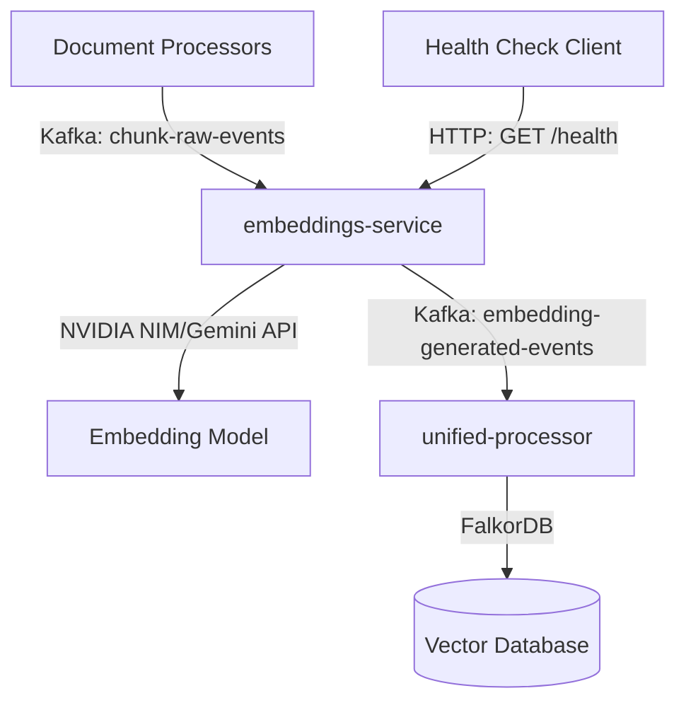

# embeddings-service Architecture

## Overview
This document describes the high-level architecture of `embeddings-service`, a Kafka-based embedding generation service for the ConFuse platform.

## System Design

```mermaid
graph TD
    A[Document Processors] -->|Kafka: chunk-raw-events| B[embeddings-service]
    B -->|NVIDIA NIM/Gemini API| C[Embedding Model]
    B -->|Kafka: embedding-generated-events| D[unified-processor]
    D -->|FalkorDB| E[(Vector Database)]
    F[Health Check Client] -->|HTTP: GET /health| B
```

## Key Components

### 1. Kafka Worker (`src/infra/kafka_worker.rs`)
- Consumes `SimplifiedChunkRawEvent` from input topic
- Coordinates embedding generation for multiple chunks
- Publishes `SimplifiedEmbeddingGeneratedEvent` to output topic
- Implements retry logic and error handling
- Auto-reconnects on Kafka disconnection

### 2. Model Manager (`src/models/`)
- Manages embedding model lifecycle
- Handles API communication with NVIDIA NIM/Gemini
- Implements batch processing for efficiency
- Provides configuration-based model selection

### 3. Event Infrastructure (`src/infra/events/`)
- Kafka consumer/producer abstractions
- Event serialization/deserialization
- Resilient publishing with retry mechanism
- DLQ (Dead Letter Queue) fallback for failed events

### 4. Health Check Server
- Lightweight HTTP server on configured port
- Responds to `GET /health` with "OK"
- Required for deployment platform health checks
- Runs independently of Kafka worker

### 5. Keep-Alive Mechanism
- Self-pings every 10 minutes
- Prevents cloud provider (Render) spin-down
- Essential for services with no external HTTP traffic

## Data Flow

1. **Ingestion**: Document processors publish chunk events to Kafka
2. **Consumption**: embeddings-service consumes events from input topic
3. **Processing**: 
   - Extracts chunk content
   - Calls embedding API (NVIDIA NIM/Gemini)
   - Generates vectors for each chunk
4. **Publication**: Publishes embedding events to output topic
5. **Storage**: unified-processor consumes and stores in FalkorDB

## Error Handling

- **Kafka Connection**: Automatic retry with 5-second backoff
- **API Failures**: Individual chunk failures don't stop batch processing
- **Publishing**: Retry logic with configurable attempts
- **Health Checks**: Independent of Kafka worker status

## Performance Optimizations

- **Vec Pre-allocation**: Uses known capacity for embedding vectors
- **Batch Processing**: Configurable batch size for API calls
- **Async Processing**: Tokio-based async runtime
- **Connection Reuse**: Reuses HTTP clients and Kafka connections

## Deployment Considerations

- **Port**: Configurable via `PORT` environment variable (default: 3011)
- **Health Check**: Simple HTTP endpoint for platform monitoring
- **Kafka Dependency**: Service waits for Kafka connectivity before starting
- **Graceful Shutdown**: Proper cleanup of Kafka connections
